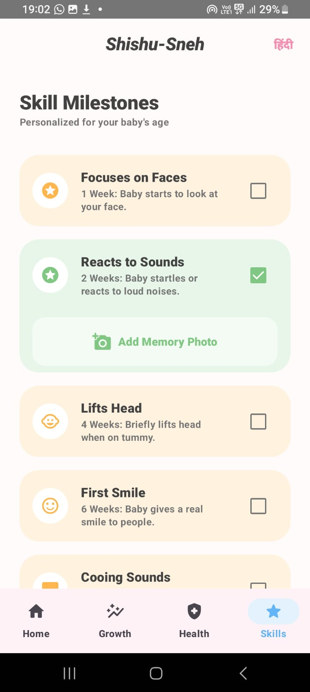

# Shishu-Sneh (शिशु-स्नेह) - VEDAA.V IVA22CD120
# **MINDMATRIX**

**Shishu-Sneh** is a comprehensive Android application designed to be a digital companion for parents during their baby's crucial first year. The app provides personalized guidance, health tracking, and milestone logging to ensure healthy growth and development.

## Features

- **Personalized Onboarding**: Create a dedicated profile for your baby including name, date of birth, and gender.
- **Smart Growth Tracking**: 
    - Log weight (kg) and height (cm) measurements.
    - Visualize growth trends with interactive line charts.
    - **Smart Analysis**: Compare your baby's growth against healthy averages and receive actionable suggestions.
- **Immunization Guide**:
    - Automated vaccination schedule based on the baby's date of birth.
    - Descriptions of diseases and vaccines (BCG, OPV, Hepatitis B, etc.).
- **Smart Notifications**:
    - Receive background alerts for upcoming mandatory vaccinations via WorkManager
- **Skill Milestones**:
    - Track developmental milestones from birth up to 5 years (e.g., first smile, first steps).
    - Capture and save "Memory Photos" for each milestone achieved.
- **Daily Tips**:
    - Personalized daily feeding and care tips for the baby.
    - Dedicated nutritional and self-care tips for the mother.
- **Multilingual Support**: Fully functional in both **English** and **Hindi**.

## Tech Stack

- **UI**: Jetpack Compose (Material 3)
- **Language**: Kotlin
- **Database**: Room Persistence Library
- **Background Tasks**: WorkManager (for vaccine reminders)
- **Charts**: MPAndroidChart
- **Image Loading**: Coil
- **Architecture**: MVVM (Model-View-ViewModel) with Repository pattern and Kotlin Coroutines/Flow.

<h2>Screenshots</h2>
<h3>ONBOARDIN </h3>
<p align="center">
  
</p>

<h3>Dashboard Screens</h3>
<p align="center">
  
  
</p>

<h3>Growth Screens</h3>
<p align="center">
  
  
</p>

<p align="center">
  
  
  
</p>

<p align="center">
  
    
</p>

<h3>Vaccination Screens</h3>
<p align="center">
  
  
  
</p>

<h3>Additional</h3>
<p align="center">
  
</p>


## Getting Started

1.  Clone the repository:
    ```bash
    git clone https://github.com/yourusername/shishusneh.git
    ```
2.  Open the project in **Android Studio (Ladybug or newer)**.
3.  Sync the project with Gradle files.
4.  Run the application on an emulator or a physical device (API 24+).

## Project Structure

- `ui/`: Contains Compose screens and the theme definition.
- `data/`: Room entities, DAO, Database configuration, and Repository.
- `MainViewModel.kt`: Core business logic and state management.
- `VaccineReminderWorker.kt`: Handles background notification logic.
- `GrowthData.kt` & `FeedingTips.kt`: Static data and logic for analysis/tips.


